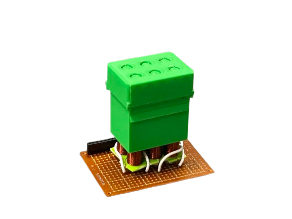

# Refreshable-Braille-Display

Group project of 2025 Practical Digital Electronics at National Taiwan University.

STL files are based on a [Hackaday project](https://hackaday.io/project/191181-electromechanical-refreshable-braille-module).

## Usage
### Components
- ESP32
- Shift Registers (74HC595)
- Motor Driver (L298N)
- Power Supply
- Electromagnets
- 3D printed body
